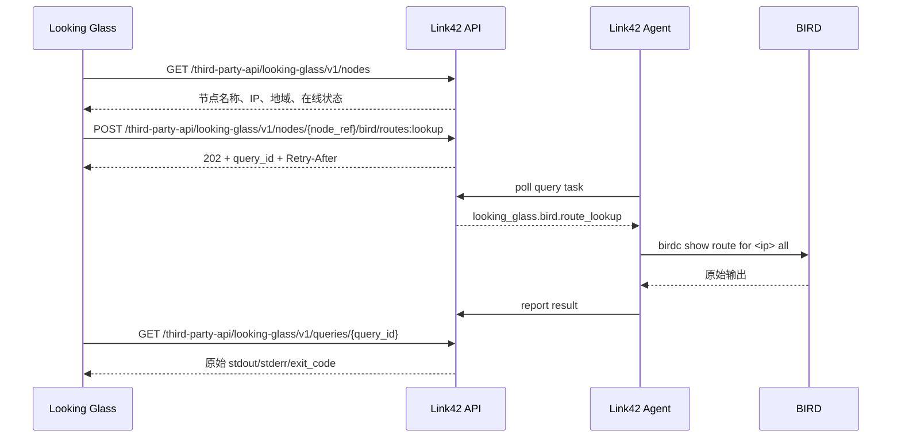

# Looking Glass 外部 API 设计

本文定义 Link42 为独立 Looking Glass 服务提供的外部 API。目标是让 Looking Glass 能读取可公开展示的节点信息，并通过 Link42 Agent 在指定节点上执行受限的 BIRD 查询。

该接口面向外部集成，不复用 Web 面板接口、节点插件接口或 Agent 内部接口。

## 1. 目标

- Looking Glass 可以获取节点名称、节点 IP、节点地域和在线状态。
- Looking Glass 可以请求节点执行 `birdc show route for <ip> all`。
- BIRD 查询结果默认返回原始输出，由 Looking Glass 自行解析和展示。
- 查询采用异步提交、轮询读取结果的方式，适配 Agent 高延迟、离线、排队和超时场景。
- 外部接口必须有独立鉴权、权限范围、节点访问白名单和限流能力。
- 外部接口不能暴露主控管理能力、内部任务 ID、节点插件能力或任意命令执行能力。

## 2. 非目标

- 不提供任意 `birdc` 命令执行。
- 不开放 `/api/tasks/{id}`、`/api/agent/...` 或节点插件任务结果。
- 不把 Looking Glass 调用放进主控配置变更任务队列，避免公开查询阻塞部署任务。
- 不要求 Link42 解析 BIRD 路由输出。Link42 只负责执行受限命令、裁剪超大输出、记录状态和返回原始文本。

## 3. API 命名空间

所有外部接口放在独立根命名空间，不挂在 Link42 自用的 `/api` 路径下：

```text
/third-party-api/looking-glass/v1
```

版本号放在路径中，后续如果响应结构需要破坏性调整，可以新增 `/v2`，保留 `/v1` 兼容。

实现要求：

- `/third-party-api/looking-glass/v1` 必须使用独立路由和独立鉴权依赖。
- 不复用 Web 面板 `/api` 的会话鉴权和白名单规则。
- 不复用 Agent `/api/agent/...` 的 token 鉴权规则。
- 反向代理可以把 `/third-party-api/looking-glass/v1` 单独暴露给公开 Looking Glass 服务，同时继续把 `/api` 作为 Link42 面板私有管理接口。

## 4. 鉴权

Looking Glass 使用专用 API Key，不使用 Web 登录态，不使用 Agent token。

请求头：

```http
Authorization: Bearer l42lg_xxx
```

建议新增数据表：

```text
integration_api_keys
- id
- name
- token_prefix
- token_hash
- token_hint
- scopes
- allowed_node_ids
- enabled
- expires_at
- last_used_at
- last_used_ip
- created_at
- created_by
- updated_at
- revoked_at
```

权限范围：

```text
looking_glass.nodes.read        # 读取节点列表和节点详情
looking_glass.bird.route        # 发起 BIRD route lookup 查询
```

暂不建议提供 `looking_glass.bird.raw` 单独权限，因为本设计默认就返回原始 BIRD 输出。如果未来需要同时提供结构化结果和原始结果，可以再拆分该权限。

校验规则：

- API Key 不存在、已禁用或过期，返回 `401`。
- 缺少对应 scope，返回 `403`。
- 节点不在 `allowed_node_ids` 中，返回 `404` 或 `403`。为减少节点枚举风险，推荐返回 `404`。
- 每次成功调用更新 `last_used_at`。

## 5. API Token 生成和管理

API Token 由 Link42 管理员在主控面板的“系统设置 -> Looking Glass API Token”中生成，不在第三方公开接口中提供自助生成能力。Token 管理接口属于 Link42 自用管理接口，可以继续放在现有 `/api` 命名空间，并使用 Web 管理员会话鉴权。

管理端接口建议：

```text
GET    /api/integrations/looking-glass/tokens
POST   /api/integrations/looking-glass/tokens
PATCH  /api/integrations/looking-glass/tokens/{token_id}
POST   /api/integrations/looking-glass/tokens/{token_id}/rotate
POST   /api/integrations/looking-glass/tokens/{token_id}/revoke
DELETE /api/integrations/looking-glass/tokens/{token_id}
```

创建 Token 请求：

```json
{
  "name": "public-looking-glass",
  "scopes": ["looking_glass.nodes.read", "looking_glass.bird.route"],
  "allowed_node_ids": [8, 15],
  "expires_at": "2027-07-10T00:00:00Z"
}
```

创建 Token 响应：

```json
{
  "id": 1,
  "name": "public-looking-glass",
  "token": "l42lg_01JZEXAMPLE_xxxxxxxxxxxxxxxxxxxxxxxxxxxxxxxxxxxxxxxxxxx",
  "token_prefix": "l42lg_01JZEXAMPLE",
  "token_hint": "xxxxxxwxyz",
  "scopes": ["looking_glass.nodes.read", "looking_glass.bird.route"],
  "allowed_node_ids": [8, 15],
  "enabled": true,
  "expires_at": "2027-07-10T00:00:00Z",
  "created_at": "2026-07-10T09:30:00Z"
}
```

Token 生成规则：

- Token 格式建议为 `l42lg_<public_id>_<secret>`。
- `public_id` 使用 ULID 或随机短 ID，便于日志定位。
- `secret` 使用密码学安全随机数生成，至少 32 bytes，使用 URL-safe base64 编码。
- 完整 Token 只在创建和轮换响应中返回一次，后续列表和详情接口不再返回。
- 数据库只保存 `token_hash`、`token_prefix` 和 `token_hint`，不保存明文 Token。
- `token_hash` 建议使用 `HMAC-SHA256(server_secret, full_token)`；如果没有独立 server secret，也必须至少保存 SHA-256 摘要，不能保存明文。
- `token_hint` 保存末尾 8 到 10 个字符，方便管理员识别正在使用的 Token。

Token 列表响应不返回明文：

```json
{
  "items": [
    {
      "id": 1,
      "name": "public-looking-glass",
      "token_prefix": "l42lg_01JZEXAMPLE",
      "token_hint": "xxxxxxwxyz",
      "scopes": ["looking_glass.nodes.read", "looking_glass.bird.route"],
      "allowed_node_ids": [8, 15],
      "enabled": true,
      "expires_at": "2027-07-10T00:00:00Z",
      "last_used_at": "2026-07-10T09:35:00Z",
      "last_used_ip": "203.0.113.10",
      "created_at": "2026-07-10T09:30:00Z",
      "revoked_at": null
    }
  ]
}
```

轮换规则：

- `rotate` 生成新 Token，立即替换旧 `token_hash`。
- 轮换响应只返回一次新明文 Token。
- 如果需要无中断轮换，建议创建第二个 Token，确认 Looking Glass 切换后再吊销旧 Token。

吊销和删除规则：

- `revoke` 设置 `enabled=false` 和 `revoked_at`，保留审计记录。
- `DELETE` 仅用于删除未使用或误创建的 Token；已经使用过的 Token 推荐只吊销不硬删除。
- 被吊销、禁用或过期的 Token 调用第三方接口统一返回 `401 invalid_api_key`。

## 6. 节点信息接口

### 6.1 获取节点列表

```http
GET /third-party-api/looking-glass/v1/nodes
```

所需权限：

```text
looking_glass.nodes.read
```

查询参数：

```text
region      可选，按节点地域过滤
online      可选，true/false
limit       可选，默认 100，最大 500
cursor      可选，分页游标
```

响应示例：

```json
{
  "items": [
    {
      "node_ref": "node_8",
      "name": "tencguangzhou",
      "region": "华南",
      "online": true,
      "last_seen_at": "2026-07-10T09:30:00Z",
      "ips": {
        "management_ip": "10.1.0.6",
        "public_ip": "1.14.226.49",
        "endpoint_ips": ["1.14.226.49", "10.1.0.6"]
      },
      "capabilities": {
        "bird": true,
        "bird_route_lookup": true
      }
    }
  ],
  "next_cursor": null
}
```

字段说明：

- `node_ref`：外部稳定引用，不直接暴露数据库自增 ID。可以使用 `node_<id>` 或后续迁移为 UUID。
- `name`：节点名称。
- `region`：节点地域。没有配置时返回空字符串或 `null`，建议前端按“未分组”展示。
- `online`：根据 Agent 心跳计算的在线状态。
- `last_seen_at`：最后一次 Agent 心跳时间。
- `ips.management_ip`：节点管理地址。
- `ips.public_ip`：节点公网地址。
- `ips.endpoint_ips`：节点配置中的入口地址列表，适合 Looking Glass 展示或选择。
- `capabilities.bird_route_lookup`：节点当前 Agent 是否支持 Looking Glass BIRD 查询。

节点 IP 返回策略：

- 只返回 Link42 节点模型中已经显式维护的 IP 字段。
- 不从系统接口扫描额外地址，避免泄露节点内网细节。
- 如果某个地址为空，字段保留为 `null` 或空数组，不从响应中删除字段，方便 Looking Glass 兼容。

### 6.2 获取节点详情

```http
GET /third-party-api/looking-glass/v1/nodes/{node_ref}
```

所需权限：

```text
looking_glass.nodes.read
```

响应结构与节点列表中的单个 `item` 一致，可以额外返回描述信息：

```json
{
  "node_ref": "node_8",
  "name": "tencguangzhou",
  "region": "华南",
  "online": true,
  "last_seen_at": "2026-07-10T09:30:00Z",
  "ips": {
    "management_ip": "10.1.0.6",
    "public_ip": "1.14.226.49",
    "endpoint_ips": ["1.14.226.49", "10.1.0.6"]
  },
  "capabilities": {
    "bird": true,
    "bird_route_lookup": true
  }
}
```

## 7. BIRD Route Lookup 查询

### 7.1 提交查询

```http
POST /third-party-api/looking-glass/v1/nodes/{node_ref}/bird/routes:lookup
```

所需权限：

```text
looking_glass.bird.route
```

请求体：

```json
{
  "ip": "1.1.1.1"
}
```

校验规则：

- `ip` 必须是合法 IPv4 或 IPv6 字面量。
- 主控使用标准 IP 解析库规范化 `ip`，不能把用户输入拼接进 shell。
- 节点必须在线，否则返回 `409 node is offline`。
- 节点 Agent 必须上报 `bird_route_lookup` 能力，否则返回 `409 node does not support bird route lookup`。
- 同一 API Key、同一节点、同一 IP 的短时间重复请求可以复用缓存结果或返回同一个未完成查询。

成功响应：

```http
HTTP/1.1 202 Accepted
Location: /third-party-api/looking-glass/v1/queries/lgq_01JZ...
Retry-After: 1
```

```json
{
  "query_id": "lgq_01JZ...",
  "status": "queued",
  "node_ref": "node_8",
  "operation": "bird.route_lookup",
  "request": {
    "ip": "1.1.1.1",
    "normalized_ip": "1.1.1.1"
  },
  "created_at": "2026-07-10T09:30:00Z",
  "deadline_at": "2026-07-10T09:30:15Z",
  "expires_at": "2026-07-10T09:40:00Z"
}
```

### 7.2 查询状态和结果

```http
GET /third-party-api/looking-glass/v1/queries/{query_id}
```

所需权限：

```text
looking_glass.bird.route
```

处理中响应：

```json
{
  "query_id": "lgq_01JZ...",
  "status": "running",
  "node_ref": "node_8",
  "operation": "bird.route_lookup",
  "request": {
    "ip": "1.1.1.1",
    "normalized_ip": "1.1.1.1"
  },
  "created_at": "2026-07-10T09:30:00Z",
  "started_at": "2026-07-10T09:30:01Z",
  "finished_at": null,
  "deadline_at": "2026-07-10T09:30:15Z",
  "expires_at": "2026-07-10T09:40:00Z",
  "result": null,
  "error": null
}
```

成功响应：

```json
{
  "query_id": "lgq_01JZ...",
  "status": "succeeded",
  "node_ref": "node_8",
  "operation": "bird.route_lookup",
  "request": {
    "ip": "1.1.1.1",
    "normalized_ip": "1.1.1.1"
  },
  "created_at": "2026-07-10T09:30:00Z",
  "started_at": "2026-07-10T09:30:01Z",
  "finished_at": "2026-07-10T09:30:02Z",
  "deadline_at": "2026-07-10T09:30:15Z",
  "expires_at": "2026-07-10T09:40:00Z",
  "result": {
    "command": "birdc show route for 1.1.1.1 all",
    "exit_code": 0,
    "stdout": "BIRD 2.0.12 ready.\nTable master4:\n...",
    "stderr": "",
    "truncated": false,
    "duration_ms": 83
  },
  "error": null
}
```

失败响应：

```json
{
  "query_id": "lgq_01JZ...",
  "status": "failed",
  "node_ref": "node_8",
  "operation": "bird.route_lookup",
  "request": {
    "ip": "1.1.1.1",
    "normalized_ip": "1.1.1.1"
  },
  "created_at": "2026-07-10T09:30:00Z",
  "started_at": "2026-07-10T09:30:01Z",
  "finished_at": "2026-07-10T09:30:02Z",
  "deadline_at": "2026-07-10T09:30:15Z",
  "expires_at": "2026-07-10T09:40:00Z",
  "result": null,
  "error": {
    "code": "command_failed",
    "message": "BIRD 查询执行失败"
  }
}
```

状态枚举：

```text
queued       已入队，等待 Agent 拉取
running      Agent 已拉取并正在执行
succeeded    执行完成
failed       执行失败
expired      查询结果已过期
cancelled    被主控取消
```

结果保留：

- `succeeded` 和 `failed` 结果默认保留 10 分钟。
- 过期后 `GET /queries/{query_id}` 返回 `410 result expired`。
- 查询 ID 是不透明 ID，不暴露内部 `agent_tasks.id`。

## 8. 高延迟和队列设计

Looking Glass 查询不能阻塞 Link42 的配置部署任务。建议扩展 Agent 任务模型：

```text
agent_tasks
- queue          # control / query
- priority
- deadline_at
```

队列语义：

- `control`：现有配置部署、启动、停止、删除任务，保持串行和依赖顺序。
- `query`：Looking Glass、只读诊断等查询任务，允许独立并发。
- Agent 默认同时执行最多 2 个 `query` 任务。
- 单节点 `query` 队列默认最多保留 10 到 20 个未完成任务。
- 队列满时提交接口返回 `429 query queue is full`。
- `query` 任务超时、取消或过期不能影响 `control` 队列。

建议超时：

```text
排队超时       30 秒
命令执行超时   15 秒
总截止时间     60 秒
结果保留       10 分钟
重复查询缓存   3 到 5 秒
```

客户端轮询建议：

```text
首次 500ms 后轮询
之后 1s、2s 退避
收到 Retry-After 时优先遵守服务端建议
超过 deadline_at 后停止等待并提示超时
```

## 9. Agent 执行约束

Agent 新增受限任务类型：

```text
looking_glass.bird.route_lookup
```

任务 payload：

```json
{
  "ip": "1.1.1.1",
  "command_timeout_seconds": 8,
  "output_limit_bytes": 262144
}
```

Agent 执行要求：

- 固定执行 `birdc show route for <normalized_ip> all`。
- 使用 argv 调用，例如 `["birdc", "show", "route", "for", normalized_ip, "all"]`。
- 禁止 shell 拼接。
- 禁止调用方指定 BIRD socket、配置文件、表名或额外参数。
- 命令超时后必须杀死子进程并返回 `timeout` 错误。
- `stdout` 和 `stderr` 分别限制最大 256 KiB，超出后截断并设置 `truncated=true`。
- 返回 `exit_code`、`stdout`、`stderr`、`truncated`、`duration_ms`。

Agent 能力上报建议：

```json
{
  "capabilities": [
    "bird",
    "looking_glass.bird.route_lookup"
  ]
}
```

主控展示给外部 API 时可以折叠为：

```json
{
  "capabilities": {
    "bird": true,
    "bird_route_lookup": true
  }
}
```

## 10. 数据模型

建议新增查询表：

```text
looking_glass_queries
- id
- public_id
- api_key_id
- node_id
- operation
- request
- request_fingerprint
- status
- agent_task_id
- result
- error_code
- error_message
- created_at
- started_at
- finished_at
- deadline_at
- expires_at
```

字段说明：

- `public_id`：外部查询 ID，例如 `lgq_` 前缀 ULID。
- `request_fingerprint`：用于短时间复用相同查询，建议包含 API Key、节点、操作和规范化 IP。
- `agent_task_id`：内部任务 ID，只在主控内部关联，不返回给外部调用方。
- `result`：保存原始命令结果。
- `error_code` 和 `error_message`：保存给外部调用方展示的稳定错误。

## 11. 错误码

```text
400 invalid_request          请求格式错误或 IP 非法
401 invalid_api_key          API Key 不存在、禁用或过期
403 permission_denied        缺少 scope
404 node_not_found           节点不存在或不在白名单
404 query_not_found          查询不存在或不属于当前 API Key
409 node_offline             节点离线
409 capability_missing       节点不支持该查询
410 result_expired           查询结果已过期
429 rate_limited             触发限流
429 query_queue_full         节点查询队列已满
503 query_queue_unavailable  查询队列不可用
```

错误响应格式：

```json
{
  "error": {
    "code": "node_offline",
    "message": "节点当前离线，无法执行查询"
  }
}
```

## 12. 安全边界

- 外部 API Key 只能访问授权节点。
- 外部 API 不返回 Agent token、安装命令、配置文件内容、插件任务输出或主控敏感设置。
- BIRD 查询只接受 IP，不接受任意命令片段。
- 主控不把内部任务 ID 暴露给 Looking Glass。
- Looking Glass 查询任务使用独立 `query` 队列，避免大量公开查询拖慢部署。
- 对同一 API Key 和同一节点做速率限制。
- 日志中只记录 API Key 前缀，不记录完整 token。
- 原始 BIRD 输出可能包含路由策略、社区值和下一跳信息，因此 API Key 应只发给可信 Looking Glass 服务。

## 13. 推荐调用流程



## 14. 实施顺序

1. 新增集成 API Key 表、Token 生成、Token 轮换、吊销、scope 校验和节点白名单。
2. 新增 `/third-party-api/looking-glass/v1/nodes` 和节点详情接口。
3. 新增 `looking_glass_queries` 表和异步查询提交、轮询接口。
4. 新增 Agent 受限任务 `looking_glass.bird.route_lookup`。
5. 将 Agent 任务区分为 `control` 和 `query` 队列，避免查询阻塞部署。
6. 增加超时、输出限制、短缓存、限流和过期清理。
7. 增加单元测试，覆盖 Token 鉴权、节点过滤、IP 校验、任务入队、超时、输出截断和查询结果读取。
